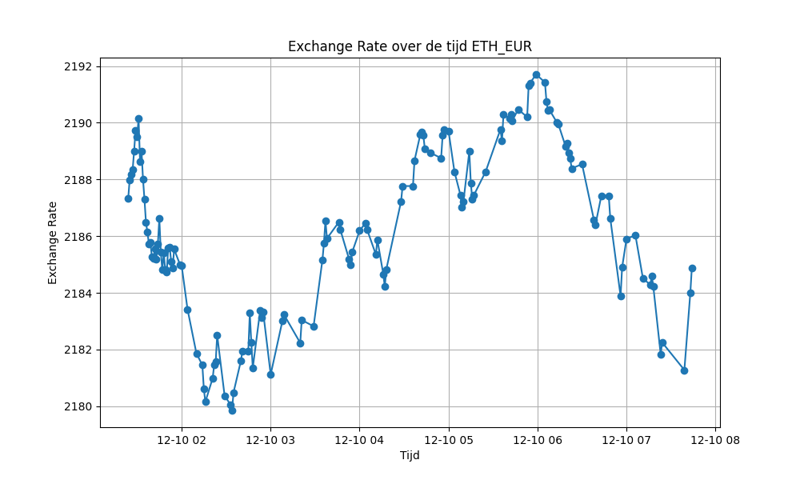

# Exchange Rate Analyse Rapport

Dit rapport bevat de resultaten van de analyse van de uitwisselingskoers.

## Inleiding

Lorem ipsum dolor sit amet, consectetur adipiscing elit, sed do eiusmod tempor incididunt ut labore et dolore magna aliqua. Ut enim ad minim veniam, quis nostrud exercitation ullamco laboris nisi ut aliquip ex ea commodo consequat. 

## Grafiek 1: BTC/EUR

| Statistiek                 | Waarde               |
|----------------------------|----------------------|
| Gemiddelde Exchange Rate   | 24157.3771830655    |
| Standaarddeviatie          | 31.218823916325945   |
| Minimale Exchange Rate     | 24110.68563340281    |
| Maximale Exchange Rate     | 24208.3111980872     |

## Grafiek 2: ETH/EUR

| Statistiek                 | Waarde               |
|----------------------------|----------------------|
| Gemiddelde Exchange Rate   | 1542.3881276903867    |
| Standaarddeviatie          | 4.460368545423732   |
| Minimale Exchange Rate     | 1538.6843491407346    |
| Maximale Exchange Rate     | 1554.1394080412697     |

## Grafiek 3: BTC/ETH

| Statistiek                 | Waarde               |
|----------------------------|----------------------|
| Gemiddelde Exchange Rate   | 15.66174040201999    |
| Standaarddeviatie          | 0.03477616830307345   |
| Minimale Exchange Rate     | 15.56630162047002    |
| Maximale Exchange Rate     | 15.689878871224838     |

## Conclusie

Lorem ipsum dolor sit amet, consectetur adipiscing elit, sed do eiusmod tempor incididunt ut labore et dolore magna aliqua. Ut enim ad minim veniam, quis nostrud exercitation ullamco laboris nisi ut aliquip ex ea commodo consequat. 

============================================================================================

Dit rapport is gegenereerd op: 2023-08-21 00:21:50.290024
